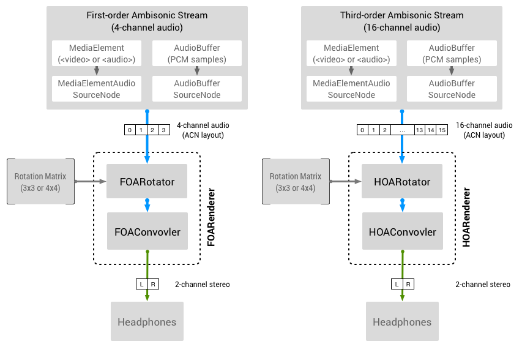

# Omnitone: Spatial Audio Rendering on the Web

[![ci][ci-badge]][ci-url]
[![npm][npm-badge]][npm-url]
[![GitHub license][license-badge]][license-url]

Omnitone is a robust implementation of
[ambisonic](https://en.wikipedia.org/wiki/Ambisonics) decoding and binaural
rendering written in Web Audio API. Its rendering process is powered by the fast
native features from Web Audio API (`GainNode` and `ConvolverNode`), ensuring
optimum performance.

The implementation of Omnitone is based on the
[Google spatial media](https://github.com/google/spatial-media) specification
and [SADIE's binaural filters][sadie-url]. It also powers
[Resonance Audio SDK][resonance-url] for web.

- [What's New in 2.0](#whats-new-in-20)
- [Usage](#usage)
  + [FOARenderer](#foarenderer)
  + [HOARenderer](#hoarenderer)
  + [Rotation and Rendering Mode](#rotation-and-rendering-mode)
- [Development](#development)
- [Audio Codec Compatibility](#audio-codec-compatibility)

If you are looking for interactive panning based on Omnitone's ambisonic
rendering, be sure to check out the [Resonance Audio Web SDK][resonance-url]
project!

### Feature Highlights

Omnitone offers __ambisonic decoding__ and __binaural rendering__ of:
- First-order-ambisonic stream (4 channels)
- Higher-order-ambisonic stream (2nd order / 9 channels and 3rd order / 16
  channels)

### Omnitone in action:

- __[Omnitone Demos](https://googlechrome.github.io/omnitone/#home)__
- __[Omnitone Examples][examples-url]__
- __[Resonance Audio Web SDK][resonance-url]__


## What's New in 2.0

- **Bundler & SSR support (`#105`):** `build/omnitone.js` and
  `build/omnitone.min.js` are now built as UMD modules (working both as a
  `<script>` global and via `require('omnitone')`), paired with `"module"` and
  `"exports"` entry points in `package.json` for `import Omnitone from
  'omnitone'` and browser global guards for Node / SSR environments.
- **CSP compatibility without `'unsafe-eval'` (`#106`, `#147`):** Rewrote
  `BufferList.load()` around `Promise.all` and removed `new Function()`, so
  Omnitone runs under strict Content Security Policies.
- **Setters work before `initialize()` resolves (`#102`, `#145`):**
  `setChannelMap()`, `setRotationMatrix3()`, `setRotationMatrix4()`,
  `setRotationMatrixFromCamera()`, and `setRenderingMode()` (as well as
  constructor-supplied `renderingMode: 'bypass' | 'off'`) now apply immediately
  upon renderer construction and persist across HRIR initialization.
- **Clean promise rejection handling (`#146`, `#150`):** Load and decode
  failures in `BufferList`, `FOARenderer`, and `HOARenderer` now reject the
  returned promise cleanly without throwing uncaught exceptions or leaking
  duplicate `unhandledrejection` events from `decodeAudioData()`.
- **Correctness fixes (`#143`, `#144`):** Fixed destination indices and sign
  mapping in `HOARotator.prototype.getRotationMatrix3()`, and renamed
  `Omnitone.splitBufferbyChannel` to `Omnitone.splitBufferByChannel` (fixing an
  internal `bufflerList` reference error in `Utils.mergeBufferListByChannel`).
- **Modernized toolchain (`#148`, `#149`):** Upgraded build, lint, and test
  infrastructure to Node `>=20`, Rollup 4, `@web/test-runner` (headless Chrome),
  ESLint 8, and GitHub Actions CI.


## How it works

The input audio stream can be either an `HTMLMediaElement` (`<video>` or
`<audio>` tag) or a multichannel `AudioBufferSourceNode`. The rotation of the
sound field can also be easily linked to a device's orientation sensor or
on-screen camera interaction.

<p align="center">
  
</p>


## Usage

Include the library file in an HTML document from Google's CDN:

```html
<script
  src="https://www.gstatic.com/external_hosted/omnitone/build/omnitone.min.js">
</script>
<script>
  // `Omnitone` object is loaded and ready.
  const audioContext = new AudioContext();
  const foaRenderer = Omnitone.createFOARenderer(audioContext);
</script>
```

Alternatively, install Omnitone as part of your local development via
[NPM](https://www.npmjs.com/package/omnitone):

```bash
npm install omnitone
```

Omnitone provides both ES module and UMD/CommonJS entry points for bundlers:

```js
import Omnitone from 'omnitone';
// or: const Omnitone = require('omnitone');

const audioContext = new AudioContext();
const foaRenderer = Omnitone.createFOARenderer(audioContext);
```

You can also `git clone` the repository and use the library files in `build/`:

```bash
git clone https://github.com/GoogleChrome/omnitone.git
```

### FOARenderer

`FOARenderer` decodes and renders a first-order-ambisonic stream (4 channels).

```js
// Set up an audio element to feed the ambisonic source audio feed.
const audioElement = document.createElement('audio');
audioElement.src = 'audio-file-foa-acn.wav';

// Create AudioContext, MediaElementSourceNode and FOARenderer.
const audioContext = new AudioContext();
const audioElementSource = audioContext.createMediaElementSource(audioElement);
const foaRenderer = Omnitone.createFOARenderer(audioContext);

// Make connection and start play. Hook up the user input for the playback.
foaRenderer.initialize().then(function() {
  audioElementSource.connect(foaRenderer.input);
  foaRenderer.output.connect(audioContext.destination);

  // This is necessary to activate audio playback out of autoplay block.
  someButton.onclick = () => {
    audioContext.resume();
    audioElement.play();
  };
});
```

### HOARenderer

`HOARenderer` decodes and renders higher-order-ambisonic streams. Omnitone
supports 2nd and 3rd order ambisonics, which consist of 9 channels and 16
channels respectively.

```js
// Works the same way as FOARenderer. See the usage above.
const hoaRenderer = Omnitone.createHOARenderer(audioContext);
```

### Rotation and Rendering Mode

The rotation matrix in an Omnitone renderer can be updated inside your
application's animation loop to rotate the entire sound field. Omnitone supports
both 3x3 and 4x4 rotation matrices (column-major). Setter calls made before
`initialize()` resolves are preserved automatically.

```js
// Rotation with 3x3 or 4x4 matrix.
renderer.setRotationMatrix3(rotationMatrix3);
renderer.setRotationMatrix4(rotationMatrix4);
```

For example, if you want to hook up a Three.js perspective camera:

```js
renderer.setRotationMatrix4(camera.matrixWorld.elements);
```

Use `setRenderingMode` (or pass `{renderingMode}` to the renderer constructor)
to change the operation of the decoder. This is useful when switching between
spatial media (ambisonic) and non-spatial media (mono or stereo), or when saving
CPU power by disabling the decoder.

```js
// Mono or regular multi-channel layouts.
renderer.setRenderingMode('bypass');

// Use ambisonic rendering.
renderer.setRenderingMode('ambisonic');

// Disable encoding completely (audio processing disabled).
renderer.setRenderingMode('off');
```


## Development

### Building Omnitone Locally

For development, clone the repository and run the following scripts to build the
library. Omnitone uses [Rollup](https://rollupjs.org/) to bundle the sources.

```bash
npm ci              # install dependencies.
npm run build       # build omnitone library files.
npm run build-doc   # build JSDoc documentation.
npm run eslint      # run ESLint against source and test files.
```

### Test

Omnitone uses [GitHub Actions](https://github.com/features/actions) and
[Web Test Runner](https://modern-web.dev/docs/test-runner/overview/) for
automated testing. The test suite requires the promisified version of
`OfflineAudioContext`, so it runs in a locally installed Chrome. Running
`npm test` rebuilds the bundles first, so the tests never run against a stale
`build/omnitone.min.js`.

```bash
npm test
```

#### Local Testing on Linux

The test suite requires a Chromium-based browser, so the following setup might
be necessary on Linux distros without one installed.

```bash
sudo apt install google-chrome-stable
```


## Audio Codec Compatibility

Omnitone is designed to run on any browser that supports Web Audio API; however,
it does not address incompatibility issues around media codecs across browsers.
Decoding compressed multichannel audio with more than 3 channels via `<video>`
or `<audio>` elements may not be supported on some mobile browsers.


## Related Resources

* [Web Audio API](https://webaudio.github.io/web-audio-api)
* [Google Spatial Media](https://github.com/google/spatial-media)
* [Resonance Audio Web SDK][resonance-url]


## Acknowledgments

Special thanks to Boris Smus, Brandon Jones, Dillon Cower, Drew Allen, Julius
Kammerl and Marcin Gorzel for their help on this project. We are also grateful
to Tim Fain and Jaunt VR for their permission to use beautiful VR contents in
the demo.


## Support

If you have found an error in this library, please file an issue at:
https://github.com/GoogleChrome/omnitone/issues.

Patches are encouraged, and may be submitted by forking this project and
submitting a pull request through GitHub. See CONTRIBUTING for more detail.


## License

Copyright 2016 Google Inc. All Rights Reserved.

Licensed under the Apache License, Version 2.0 (the "License"); you may not use
this file except in compliance with the License. You may obtain a copy of the
License at

http://www.apache.org/licenses/LICENSE-2.0

Unless required by applicable law or agreed to in writing, software distributed
under the License is distributed on an "AS IS" BASIS, WITHOUT WARRANTIES OR
CONDITIONS OF ANY KIND, either express or implied. See the License for the
specific language governing permissions and limitations under the License.

[ci-badge]:
  https://github.com/GoogleChrome/omnitone/actions/workflows/ci.yml/badge.svg
[ci-url]: https://github.com/GoogleChrome/omnitone/actions/workflows/ci.yml
[npm-badge]: https://img.shields.io/npm/v/omnitone.svg?colorB=4bc51d
[npm-url]: https://www.npmjs.com/package/omnitone
[license-badge]:
  https://img.shields.io/badge/license-Apache%202-brightgreen.svg
[license-url]:
  https://raw.githubusercontent.com/GoogleChrome/omnitone/master/LICENSE
[sadie-url]: https://www.york.ac.uk/sadie-project/GoogleVRSADIE.html
[resonance-url]: https://github.com/resonance-audio/resonance-audio-web-sdk
[examples-url]: https://github.com/GoogleChrome/omnitone/tree/master/examples
